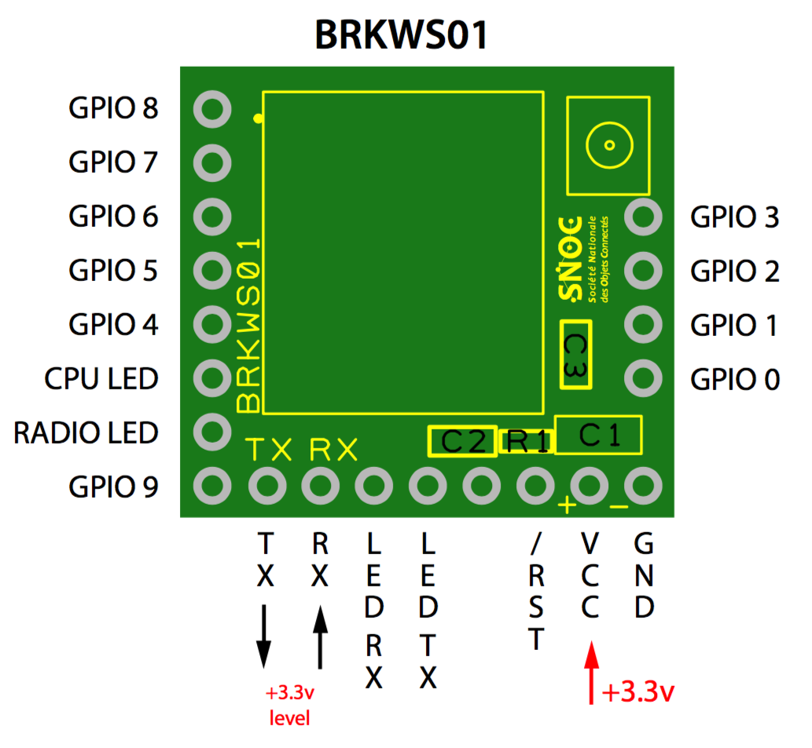

IoThings Arduino Library for
Wisol WSSFM10 Module
==============================================================

Here is all the code you need to use this module

Feel free to fork, or submit any improvements via a pull request

# Usage
## Pin connection

Connect breakout board to the Arduino as this:

* Board -> Arduino
* 3,3V  ->  3,3V
* GND   ->  GND
* RX    ->  11
* TX    ->  10

## Example
Just run the example sketch.